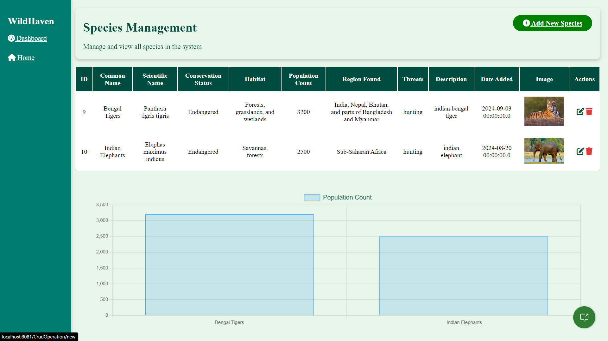
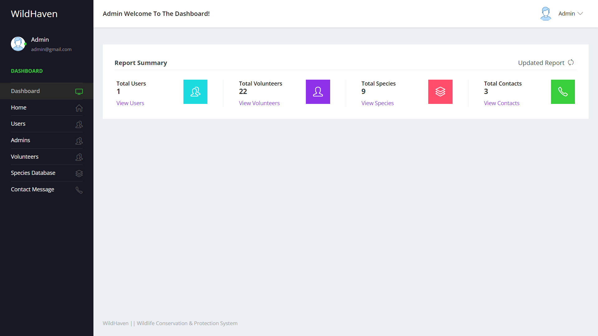
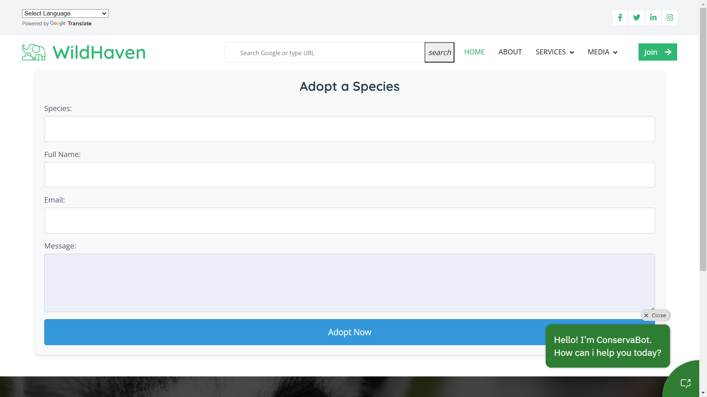

# NSTI_BHUBANESWAR_TEAM2_IBM_INTERNSHIP_FSWD_JAVA_OJT2024
# IBM INTERNSHIP: STRATS FROM 13-05-2024 TO 10-10-2024

## 📸 Project Screenshots

Here are some screenshots of the WildHaven project in action:

- **Home Page:**
  

- **Species Database:**
  

- **Admin Dashboard:**
  

- **Adopt a Species Page:**
  

# WILD HAVEN
 WildHaven is a full-stack Java-based platform designed to promote wildlife conservation and provide tools for protecting endangered species. This project focuses on delivering a professional, responsive, and user-friendly experience through modern front-end and back-end technologies.
 
## 🚀 Features

- **Interactive Wildlife Database:** Explore detailed information on various species, including their conservation status, natural habitat, and population count. This database serves as a valuable resource for researchers, conservationists, and the general public.

- **User-Friendly Interface:** Enjoy a sleek and intuitive design that ensures a seamless navigation experience across all devices. The platform's responsive layout adapts to different screen sizes, providing a consistent user experience.

- **Dynamic Data Visualization:** Utilize interactive charts and graphs to gain insights into conservation data and trends. These visualizations help in understanding the impact of conservation efforts and identifying areas that need attention.

- **IBM Watson Chatbot:** Engage with an intelligent chatbot that offers real-time support, answers user queries, and provides guidance on how to navigate the platform. The chatbot enhances user interaction by offering instant responses and assistance.

- **Multilingual Support:** Access the platform in multiple languages, making it accessible to a global audience. This feature ensures that users from different linguistic backgrounds can engage with the content effectively.

- **Automated Report Generation:** Automatically generate detailed reports on various aspects of wildlife conservation, including species data and conservation activities. This feature streamlines the reporting process and helps in tracking progress.

- **Volunteer Program:** Discover opportunities to get involved in wildlife conservation activities. The platform features tools to recruit and manage volunteers, facilitating community engagement and support for conservation efforts.

- **Map Integration:** View interactive maps that display the locations of wildlife and conservation areas. This feature helps users understand the geographical distribution of species and the locations of conservation projects.

- **Adopt a Species Program:** Contribute to wildlife conservation by adopting a species. This program allows individuals to support specific animals and their habitats, fostering a personal connection to conservation efforts.
- 
# 🛠 Technologies Used
Front-End: HTML5, CSS3, JavaScript, Bootstrap/Tailwind CSS,
Back-End: Java, JSP, Servlets,
Database: MySQL,
APIs: Google Maps API,
Version Control: Git, GitHub

# 👥 Team
Jitesh Mohapatra,
Sayan Kumar Rakshit,
Santosh Baral
